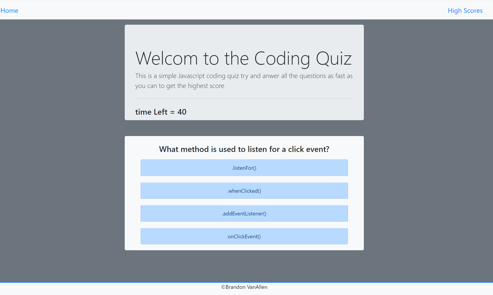

# Code Quiz - Week 4 Homework
## Project Image

-Picture of the game in action.

# Overview

This is a simple multiple choice Javascript quiz game. The goal of this project was to build a multiple choice game using plain javascript. The Html and css gets updated and changed using javascript to build an interactive multiple choice game. The users scores can be stored using local storage so their high scores can still be availble if the application gets closed or rereshed.